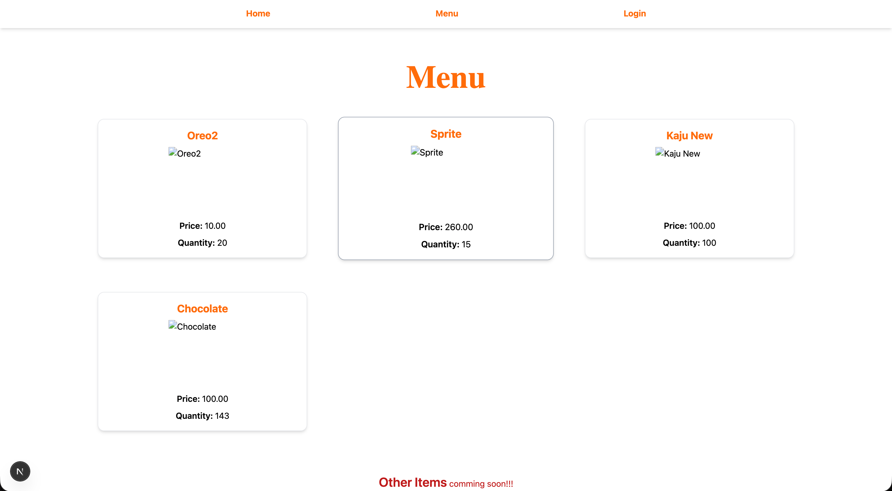
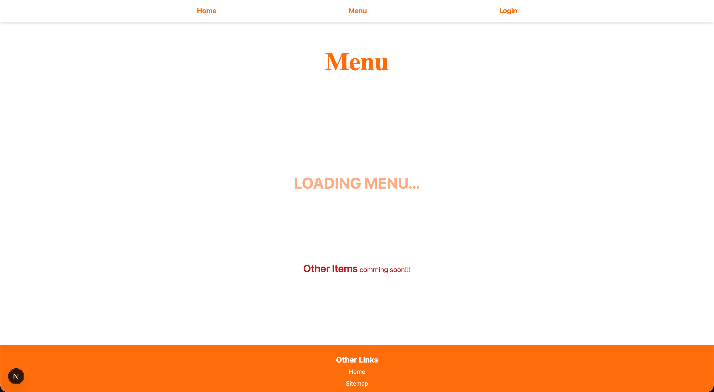
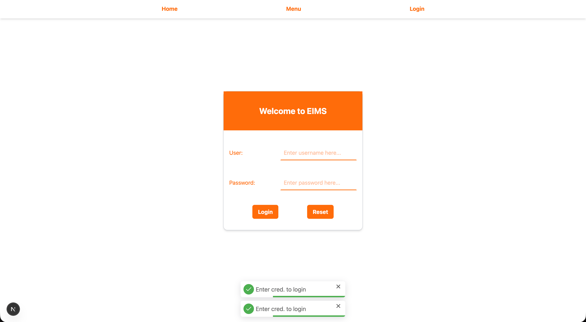
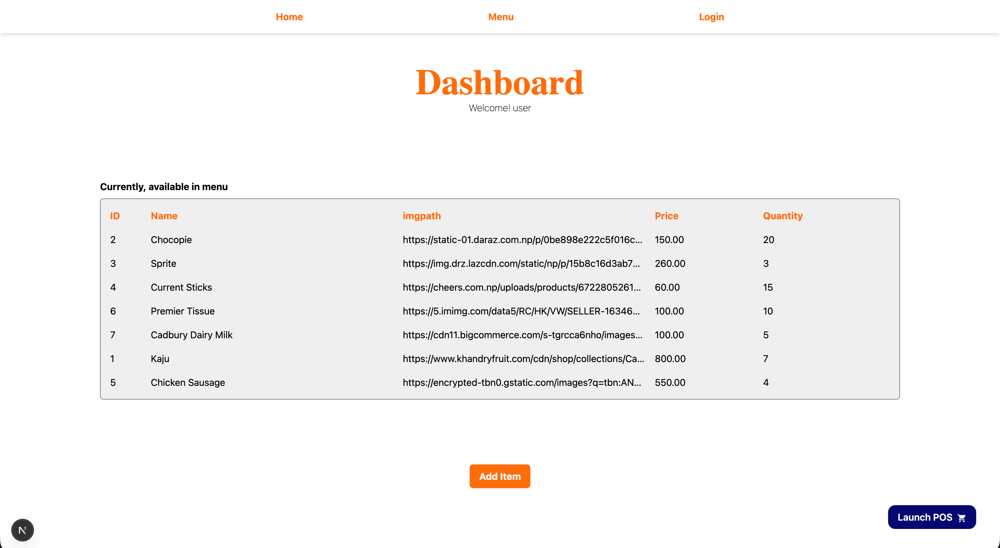
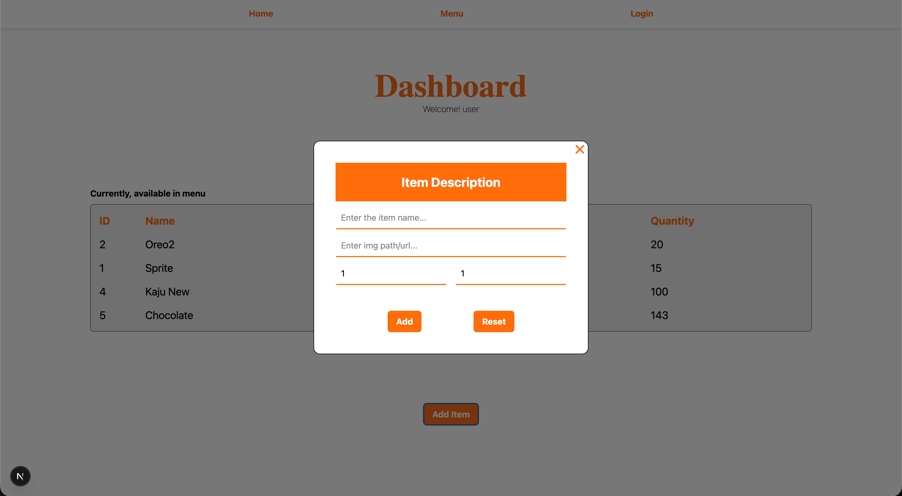
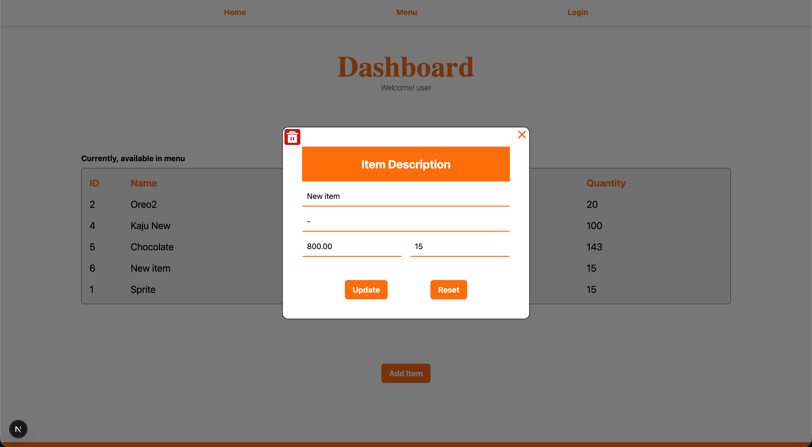
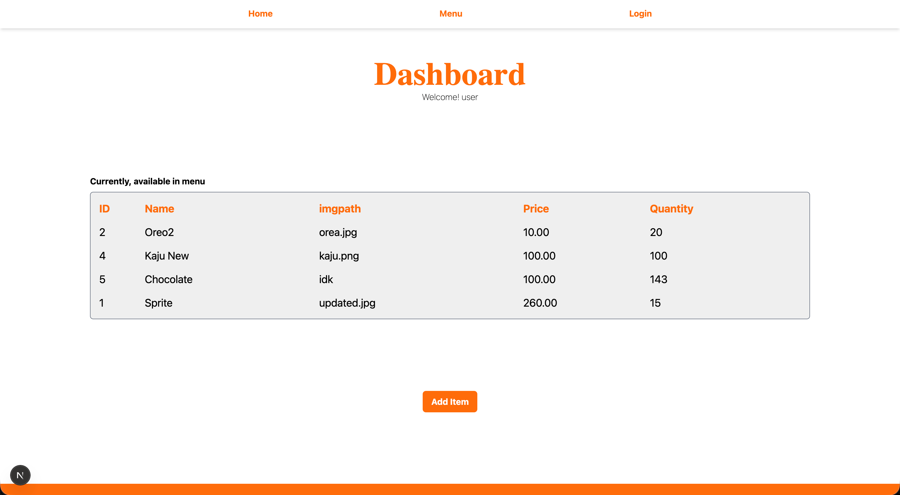

# Event Item Management System (EIMS)
This is Next.js project for managing the food/inventory items for event. (more specifically food items..).

> [!WARNING]
> Make sure your system have node ([official](https://nodejs.org/en), [brew](https://formulae.brew.sh/formula/node)).

<hr />

### How to use
1. Clone the repo
```bash
git clone -b main https://github.com/Thaparoshan143/EIMS_Nextjs
```
2. Install packages
```bash
npm i 
```
3. Run dev server
```bash 
npm run dev
```

> [!WARNING]
> Make sure the .env file is there with required credentials populated.

example of `.env` file
```
NEXT_PUBLIC_ADMIN_CRED_USER="user_here"
NEXT_PUBLIC_ADMIN_CRED_PASSWORD="password_here"
NEXT_PUBLIC_ADMIN_CRED_TOKEN="your_token"

NEXT_PUBLIC_MENU_FETCH_URL="/api/menu/"
NEXT_PUBLIC_PGDB_URL="source_to_postgresql_hosted_somewhere" 
NEXT_PUBLIC_MONGODB_URI="source_to_mongodb_uri" 
```

> [!Note]
> For the DB URL, postgresql was hosted on [render](https://render.com/) during development\
> It provides 30 days hosting for free tier. 

<hr />

**Major Packages used**
- axios
- pg
- mongodb
- nextjs-toast-notify
- refer to `packages.json` for more details..

### For now only endpoint is `/api/menu` with following methods
|Method|Params|Return|
|------|------|------|
|GET|-|object|
|POST|object|object|
|PUT|id, object|object|
|DELETE|id|object|

<hr />

### Postgresql was used in development
**For menu schema is as:**
```
id SERIAL PRIMARY KEY,
name VARCHAR(100) NOT NULL,
imgpath VARCHAR(500),
price DECIMAL(10, 2) CHECK(price > 0),
quantity INT CHECK(quantity > 0)
```

> [!IMPORTANT]
> Make sure that the table is created during first start.

<hr />

**Some Highlights**
- **Menu**

- **Menu (Loading/Fetching from DB)**


- **Login**

 
 > [!NOTE]
 > Admin access (or login) required for dashboard and different operation like add, update, delete of entries

 - **Dashboard**
 

 - **Add Item (Form)**
 

 - **Update Item (Form)**
 

 - **Delete Item (Form)**
 

 - **After Add, Update & Delete Item (Final updated table)**
 