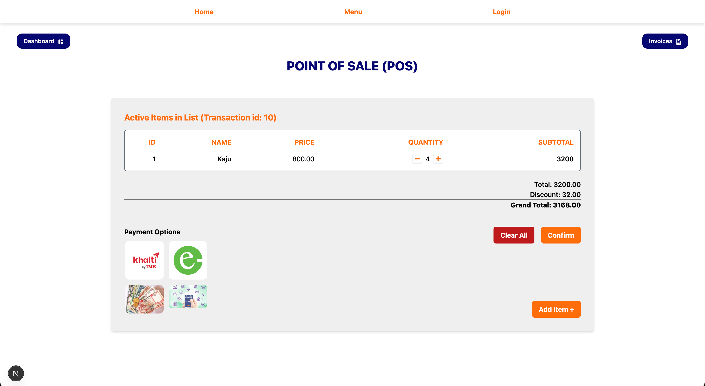
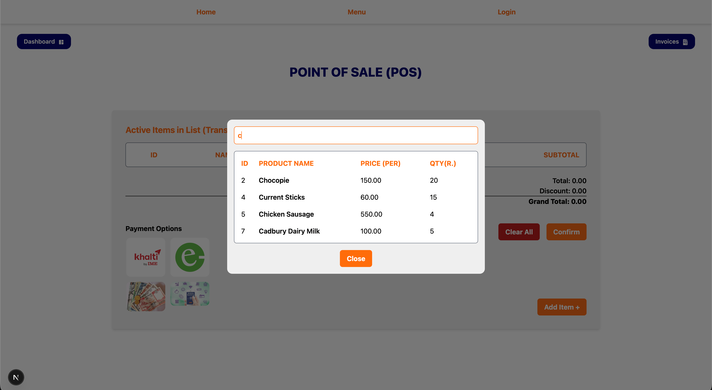
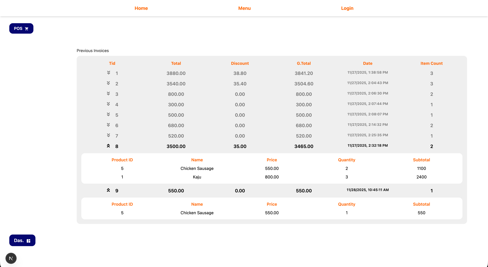

# Event Item Management System (EIMS)
This is Next.js project for managing the food/inventory items for event. (more specifically food items..).

> [!WARNING]
> Make sure your system have node ([official](https://nodejs.org/en), [brew](https://formulae.brew.sh/formula/node)).

<hr />

### How to use
1. Clone the repo
```bash
git clone -b main https://github.com/Thaparoshan143/EIMS_Nextjs
```
2. Install packages
```bash
npm i 
```
3. Run dev server
```bash 
npm run dev
```

> [!WARNING]
> Make sure the .env file with required credentials populated.

example of `.env` file
```
NEXT_PUBLIC_ADMIN_CRED_USER="user_here"
NEXT_PUBLIC_ADMIN_CRED_PASSWORD="password_here"
NEXT_PUBLIC_ADMIN_CRED_TOKEN="your_token"

NEXT_PUBLIC_MENU_FETCH_URL="/api/menu/"
NEXT_PUBLIC_POS_FETCH_URL="/api/pos/"
NEXT_PUBLIC_PGDB_URL="source_to_postgresql_hosted_somewhere" 
NEXT_PUBLIC_MONGODB_URI="source_to_mongodb_uri" 
```

> [!IMPORTANT]
> Make sure that the in PGDB (table named `menu`) & in MongoDB (new cluster DB with db named `emis-trans` & db collectio named `eims-coll`) is created during first start.

> [!Note]
> For the PGDB URL, postgresql was hosted on [render](https://render.com/) during development. It provides 30 days hosting for free tier.\
> For invoices recording [Mongodb](https://www.mongodb.com/products/platform/atlas-database) was used. (DB name: `eims-trans` & DB collection: `eims-coll`)

<hr />

### Endpoint 
**`/api/menu`** (for fetching, updating menu items)
|Method|Params|Return|
|------|------|------|
|GET|-|object|
|POST|object|object|
|PUT|id, object|object|
|DELETE|id|object|

**`/api/pos`** (currently, only used for invoice record)
|Method|Params|Return|
|------|------|------|
|GET|-|object|
|POST|object|object|

> [!Important]
> **NOT TO BE CONFUSED WITH ENPOINT NAME ABOVE.** Currently all the get/update of the menu items (like even buy.. in POS) is handled by the `/api/menu`. Only invoice fetching and posting is done by `/api/pos` as of now. **Payment Integrations** is left to be done.

<hr />

**Some Highlights**
- **Menu**


- **Menu (Loading/Fetching from DB)**


- **Login**

 
 > [!NOTE]
 > Admin access (or login) required for dashboard and different operation like add, update, delete of entries

 - **Dashboard**
 

 - **Add Item (Form)**
 

 - **Update Item (Form)**
 

 - **Delete Item (Form)**
 

 - **POS interface**
 

 - **POS Add Item (Searchable)**
 

 - **Invoice Section**
 


<hr />

### DB basic info:
**For menu schema (Postgresql)**
```
id SERIAL PRIMARY KEY,
name VARCHAR(100) NOT NULL,
imgpath VARCHAR(500),
price DECIMAL(10, 2) CHECK(price > 0),
quantity INT CHECK(quantity >= 0)
```

**For invoice json format (Mongodb, eg)**
```
{
  "tid": "4",
  "items": [
    {
      "id": "5",
      "name": "Chocolate",
      "price": "100.00",
      "quantity": "3"
    }
  ],
  "total": "300",
  "gTotal": "300",
  "discount": "0",
  "date": "11/27/2025, 2:07:44 PM"
}
```

**Major Packages used**
- axios
- pg
- mongodb
- nextjs-toast-notify
- refer to `packages.json` for more details..
